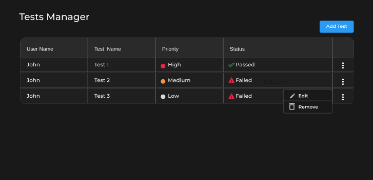

# Tests Manager

## Contexto

- Tests Manager es una aplicación que permite permite agregar, modificar y eliminar tests para QA.

  

## Requisitos

- Se necesita mostrar una tabla dinámica con el listado de los tests agregados, mostrando:
  - Nombre de usuario
  - Nombre del test
  - Prioridad: **High, Medium, Low**
  - Estado: **Passed, Failed**

- En la parte superior de la tabla, se muestra un botón de **Agregar Test**.
  - Al presionarlo, debe aparecer un Modal, con los pasos a seguir para agregar un nuevo test.
  - En este se debe pedir los siguientes datos:
    - **Nombre de usuario**: Input de texto
    - **Nombre de test**: Input de texto
    - **Prioridad**: Select con opciones de texto
    - **Estado**: Radio con valores de texto

- Por último, cada fila de la tabla debe tener en la última columna un menu para **modificar** y **eliminar** el test.
- Al **modificar**, se debe abrir el mismo Modal de creación de test, con los datos del test seleccionado.
- Cada modificación que se realiza en la tabla, debe hacerse refresh para tener los datos actualizados.

## Especificaciones Técnicas

- El diseño debe seguir el siguiente <a href="https://www.figma.com/file/FER2TvggpLxFhKOJsHBPHj/Prueba-t%C3%A9cnica-Devecoop---Front-end">Figma</a>.
- Se puede incluír librerías como **MaterialUI**, **Bootstrap**, **tailwind** o la de tu preferencia.
- La API a utilizar es <https://crudcrud.com/>, es necesario modificar la constante `API_ID` en `/src/constants/urls.js` para su funcionamiento con el token que el sitio muestra, este dura 1 dia y no es necesaria su entrega (se evaluara con uno nuevo).
  
## Requisitos previos

### Node

Version 18.17.1

#### Instalar version de node

```bash
nvm install 18.17.1
```

## Instalar dependencias del proyecto

```bash
npm install
```

## Ejecutar el linting

```bash
npm run lint
```

## Levantar proyecto en desarrollo

```bash
npm run dev
```
